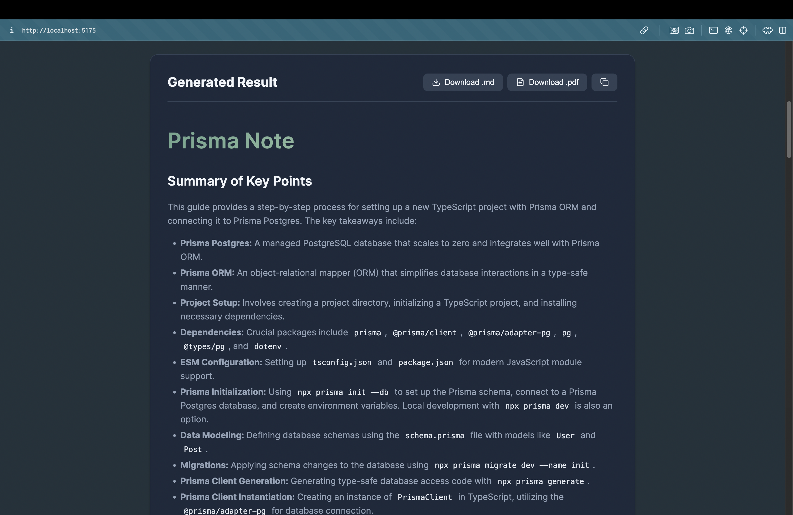

# AI Transcript Note Generator


This project is a web application that uses Google's Gemini AI to generate structured Markdown notes from video transcripts. It features a React frontend and an Express backend.

## ✨ Features

- **AI-Powered Note Generation**: Utilizes Google's **Gemini AI** to intelligently summarize and structure raw video transcripts into clean, readable notes.
- **Markdown Support**:
  - **Structured Output**: Generates headers, lists, and tables automatically.
  - **Syntax Highlighting**: Beautifully renders code blocks (SQL, Python, JavaScript, etc.) with syntax highlighting.
  - **GitHub Flavored Markdown**: Fully supports GFM features like tables and task lists.
- **Customizable Options**:
  - **Target Language**: Specify any language for the output (e.g., Traditional Chinese, English, Spanish).
  - **Custom Titles**: Name your notes for easy organization.
- **Export & Sharing**:
  - **Download as Markdown**: Save the raw `.md` file for your personal knowledge base (Obsidian, Notion, etc.).
  - **Download as PDF**: Instantly convert and download the formatted notes as a PDF document.
  - **One-Click Copy**: Quickly copy the generated markdown content to your clipboard.




## Project Structure

*   **`client/`**: React frontend application (Vite).
*   **`server/`**: Express backend application (Node.js).

## Prerequisites

*   Node.js (v18 or higher recommended)
*   Google Gemini API Key

## Setup

### 1. Backend Setup (Server)

1.  Navigate to the `server` directory:
    ```bash
    cd server
    ```
2.  Install dependencies:
    ```bash
    npm install
    ```
3.  Create a `.env` file in the `server` directory and add your Google Gemini API key:
    ```env
    GOOGLE_API_KEY=your_api_key_here
    PORT=3000
    ```
4.  Start the backend server:
    ```bash
    npm run dev  # For development (uses nodemon)
    # or
    npm start    # For production
    ```
    The server will run on `http://localhost:3000`.

### 2. Frontend Setup (Client)

1.  Open a new terminal and navigate to the `client` directory:
    ```bash
    cd client
    ```
2.  Install dependencies:
    ```bash
    npm install
    ```
3.  Create a `.env` file in the `client` directory (optional, for development proxy):
    ```env
    VITE_API_BASE_URL=http://localhost:3000
    ```
4.  Start the frontend development server:
    ```bash
    npm run dev
    ```
    The frontend will run on `http://localhost:5173` (or similar).

## Production Build

To build the frontend for production and serve it through the backend:

1.  Build the React app:
    ```bash
    cd client
    npm run build
    ```
2.  Start the backend server:
    ```bash
    cd ../server
    npm start
    ```
    The application will be available at `http://localhost:3000`.

## Features

*   **Transcript to Notes**: Converts raw transcript text into structured Markdown notes.
*   **Syntax Highlighting**: Automatically formats SQL code blocks.
*   **Language Selection**: Supports generating notes in multiple languages (English, Traditional Chinese, etc.).
*   **Download**: Export generated notes as `.md` files.

## Technologies

*   **Frontend**: React, TypeScript, Vite, React Hook Form, React Markdown, Lucide React.
*   **Backend**: Node.js, Express, TypeScript, Google GenAI SDK.
